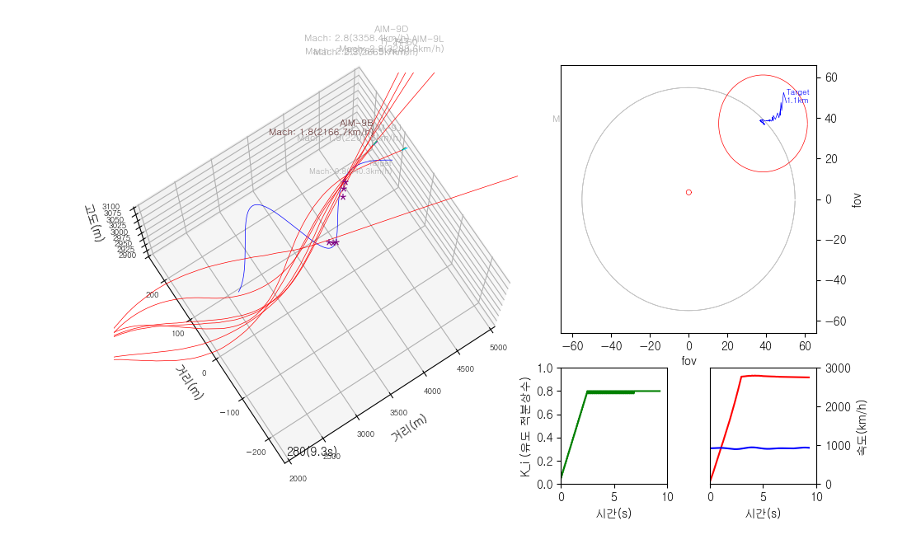

# Warthunder IR Missile Simulation

## Description

Proof of concept for re-creating Warthunder Game's Infra-red missile's behavior from laws of physics and data-mined values.

## Environment

- python3: 3.10.2
- matplotlib: 3.5.1
- numpy: 1.22.3

Run simulator.py

## Comments?

- Replacing IRguidance(.py) with other things, like Radar-Guidance or SALCOS-Guidance, this program should still work.
